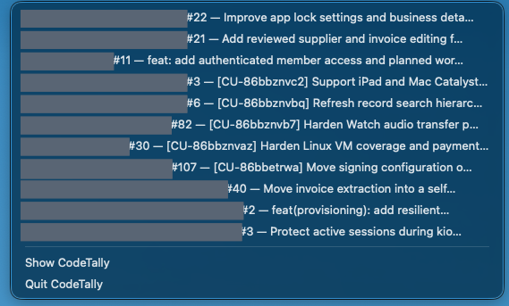
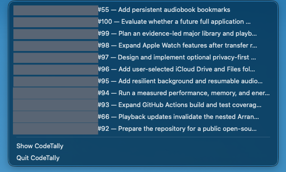
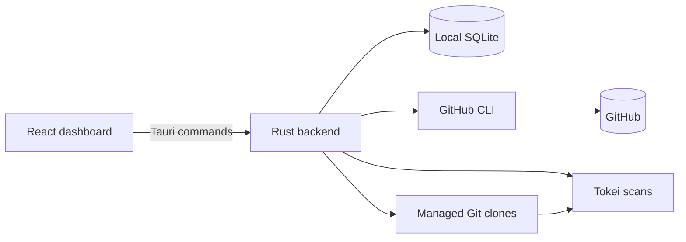

# CodeTally

<p align="center">
  <a href="https://github.com/Xzese/CodeTally/stargazers"></a>
  <a href="https://github.com/Xzese/CodeTally/commits/main"></a>
  <a href="https://tauri.app"></a>
  <a href="https://github.com/Xzese/CodeTally"></a>
  <a href="https://github.com/Xzese/CodeTally/releases"></a>
</p>

CodeTally is a local desktop dashboard for understanding the repositories available to your GitHub account. It combines source and test line history, repository metadata, and recent pull-request and issue activity in one read-only view.

The app is built with Tauri 2, React, TypeScript, Rust, SQLite, Recharts, the GitHub CLI, Git, and Tokei. It runs on your computer, stores its database and repository cache locally, and does not operate a hosted service.


## What it shows

- A portfolio summary with repository count, source lines, test lines, recent growth, open pull requests, and open issues.
- Source, test, and total line history over three months, one year, three years, or the complete sampled history.
- A sortable repository inventory with language, visibility, stars, forks, activity, and 30-day change.
- Repository detail pages with their own history, recent pull requests, recent issues, and GitHub link.
- An activity sidebar that switches between pull requests and issues and filters by state, all personal repositories, all company repositories, a particular company, or a single repository.
- Progress details during imports, full refreshes, and historical backfills.

## Menu bar

Keep selected metrics visible while CodeTally runs in the background. **Settings → Appearance & menu bar** lets you select total, source, or test lines, open PRs, and open issues, or hide all menu icons with **Show in menu bar**.


Each selected metric has its own native icon. Click the PR or issue metric to see up to 12 recently updated open items from tracked repositories, then select an item to open its GitHub page. Every metric menu also offers **Show CodeTally** and **Quit CodeTally**. Reopen the app from Applications or the Dock if its menu icons are hidden.

| Open pull requests | Open issues |
| --- | --- |
|  |  |

## Privacy and permissions

CodeTally is read-only. It does not create or edit repositories, pull requests, issues, releases, workflows, or GitHub accounts.

Authentication remains with the GitHub CLI. The app calls `gh` as a child process and reuses the account established by `gh auth login`; it never asks for or stores a GitHub token. Git commands use the GitHub CLI credential helper when private repositories are cloned into the managed cache.

The local database can contain private repository names, URLs, pull-request and issue metadata, line-count history, and local cache paths. Repository clones can contain the full source of private repositories. This data stays in the operating system's application-data directory and should never be committed or copied into this repository. The screenshots above mask private repository names and full references; public names, standalone owners, visibility labels, metrics, and activity content remain visible.

Normal `gh` and `git` operations still communicate with GitHub. Line analysis and database storage happen locally.

## Requirements

An installed build needs these commands available on `PATH` whenever it imports or refreshes data:

| Command | Purpose |
| --- | --- |
| `gh` | Authentication and GitHub repository, pull-request, and issue metadata |
| `git` | Local repository cache and historical checkouts |
| `tokei` | Language-aware code-line counting |

Development also requires Node.js/npm, Rust/Cargo, and the native prerequisites for Tauri 2. The project is currently built and verified on macOS.

Authenticate before launching the app:

```sh
gh auth login
gh auth status
gh api user --jq .login
```

## Run it locally

From the repository root:

```sh
npm install
npm run tauri:dev
```

The first launch checks for `gh`, `git`, `tokei`, and an authenticated GitHub CLI session. If GitHub authentication cannot be verified, the connection guide provides a copyable `gh auth login --hostname github.com --web` command and a **Check connection** action. Run the command in Terminal and complete GitHub's browser authorization before checking again. Once the checks pass, choose **Import repositories**.

The import discovers repositories owned by the current GitHub user and organizations visible to that account. Private repositories are eligible. Archived repositories remain available as metadata but are excluded from the active portfolio, and forks are excluded from portfolio line totals by default.

The first import can take time because the app clones each eligible repository into its private cache and samples historical commits. The interface marks totals as partial until the required repositories finish. One repository failing does not stop the remaining import.

## Build a distributable app

```sh
npm run tauri:build
```

On macOS, the `.app` and `.dmg` are written below `src-tauri/target/release/bundle/`. You can run the app bundle directly or install it from the disk image.

### Continuous integration

The [CI workflow](.github/workflows/ci.yml) runs on feature pull requests, pushes to `main`, and manual dispatch. A `main` → `release` pull request skips its duplicate CI jobs because that exact commit has already passed them on `main`; the release workflow validates it again after the merge. It checks:

- frontend behavior with Vitest and React Testing Library;
- TypeScript compilation and the Vite production build;
- Rust backend tests, including database, scanner, and GitHub sync regressions;
- release-mode Tauri compilation on native Apple Silicon and Intel macOS runners.

CI uses standard GitHub-hosted runners, read-only repository permissions, and no account credentials. GitHub sync tests use a fake CLI rather than your live account. Superseded runs are cancelled. CI does not publish releases or upload build artifacts; the release workflow below handles distributable bundles.

To prevent merging failing changes, configure repository branch protection or a ruleset to require `Frontend checks`, `Desktop checks (Apple Silicon)`, and `Desktop checks (Intel)` after the workflow has run once. Adding the workflow alone does not enforce merge protection.

### Automated GitHub releases

The [release workflow](.github/workflows/release.yml) runs only when a commit is pushed or merged into the `release` branch. Normal development merges into `main` do not publish releases. Open a pull request from `main` into `release` when the current main build is ready to ship; merging it starts one release workflow.

The release workflow selects a version, repeats the frontend and backend tests against the release commit, then builds separate macOS artifacts for Apple Silicon and Intel. Each build includes a DMG plus a signed updater archive and is mounted, deep-signature verified, architecture checked, launched briefly on a matching runner, detached, and extracted from its updater archive before upload. Cross-architecture builds still receive all structural checks; a live launch is skipped when the runner architecture does not match. A successful run creates a published GitHub Release, generates release notes, tags the release commit as `v<version>`, and attaches both DMGs, updater archives, signatures, and the static `latest.json` updater manifest.

Patch versions are automatic: if the source version is at or below the latest stable `v<major>.<minor>.<patch>` tag, the workflow increments that tag's patch version. For example, after `v0.1.2`, the next release uses `0.1.3` without a source version edit. A higher source version is used as declared, allowing intentional major or minor releases. When making such a change, update the same version in all three files:

- `package.json`
- `src-tauri/Cargo.toml`
- `src-tauri/tauri.conf.json`

Keep the root package versions in `package-lock.json` and `src-tauri/Cargo.lock` in sync as well. The selected release version is applied to all five files in each build's checkout; the workflow does not commit version bumps back to the branch. The GitHub tag and installed app record the selected version, while the source manifests retain the declared version. Publication runs are serialized so they select versions in order.

Release PRs do not build or publish releases. The version is selected after merging, using the latest tags. Rerunning an already-published commit, including recreating `release` at that commit, succeeds and skips builds and publication once the workflow confirms both macOS DMGs exist. An incomplete release or failed GitHub lookup is reported instead of being silently skipped. Workflow changes take effect after they are merged; rerunning an older failed workflow still uses its original code.

Run the release regression checks with `node --test scripts/release-preflight.check.mjs`.

Choose `CodeTally_<version>_Apple-Silicon_aarch64.dmg` for an Apple M-series Mac, or `CodeTally_<version>_Intel_x64.dmg` for an Intel Mac. Check **Apple menu → About This Mac** for your chip or processor.

macOS bundles and updater archives are ad-hoc signed and verified before publication. The release workflow requires the `TAURI_SIGNING_PRIVATE_KEY` GitHub Actions secret to create updater signatures. Builds are not Developer ID signed or notarized, so macOS may still require approval in **System Settings → Privacy & Security**. Developer ID signing and notarization require Apple signing credentials stored as GitHub Actions secrets.

Older builds such as `v0.1.2` can show “CodeTally is damaged” because the executable's linker signature does not seal the whole app bundle. Install a release containing the bundle-signing fix. Renaming an older download does not repair its signature.

## Everyday use

The **Updates** button next to Settings checks for the latest stable [GitHub release](https://github.com/Xzese/CodeTally/releases). It checks when the app starts and every day by default. In **Settings → Background & refresh**, you can change this to weekly, monthly, or never. Open the button to compare the current and new versions, **Check for updates**, or **Download update** when one is available. **Settings → About CodeTally** also checks once when you open it. **Download update** fetches and installs the signed updater archive for your Mac, then restarts CodeTally.

The rightmost **Refresh** control performs an immediate full synchronization of GitHub activity and line counts. While work is running, that same control becomes **Syncing** or **Importing**. Hover, focus, or click it to see progress; click again to pin or dismiss the details.

Automatic PR & issue refreshes keep repository metadata, pull requests, and issues current while CodeTally is running, including with its window closed when background operation is enabled. The defaults are:

- PR & issue refresh every 30 minutes for all selected repositories;
- code verification once per day (1440 minutes) as a fallback;
- fetch a repository promptly when its GitHub `pushedAt` value changes, with exact commit-SHA deduplication preventing an already measured commit from being recounted.

Settings apply automatically when you change a control and are stored in the local database. The status at the top shows when changes are being saved and provides a retry if saving fails. Rapid changes are saved in order, and the drawer stays open. Supporting explanations are available from the **?** buttons by hovering, focusing, or clicking.

**Settings → About CodeTally** displays the installed and latest versions together, update actions, and the project repository. An **About me** section introduces Sam and links to [www.samfaid.com](https://www.samfaid.com/) and [Buy Me a Coffee](https://www.buymeacoffee.com/samfaid).

The **Background & refresh** section lets you choose how often CodeTally refreshes pull requests and issues (15, 30, 60, or 120 minutes; 30 by default) and Lines of Code (6, 12, or 24 hours; daily by default). You can also enter a custom interval. Your change saves when you leave the field or press Enter.

In **Settings → Appearance & menu bar**, choose **Light**, **Dark**, or **Follow system**. Follow system is the default and responds to macOS appearance changes while the app is open.

On macOS, select one or more of **Total lines**, **Source lines**, **Test lines**, **Open PRs**, and **Open issues** to combine them in the menu bar. At least one metric stays selected, and the display uses that fixed order. Every selected metric has its own consistently aligned native icon. Clicking the PR or issue metric opens a list of up to 12 cached open items; selecting one opens its GitHub page. **Show in menu bar** can hide every CodeTally menu item. Hover or focus a card to preview adding its current cached value before selecting it. The preview shows only CodeTally's display, and the actual menu bar updates when settings change or synchronization completes. Existing single-metric preferences are preserved.

**Include forks in line totals** is disabled by default. Enable it in Settings to count selected fork repositories in portfolio totals and line history.

Enable **Open at login** to start CodeTally automatically when you sign in to your Mac. This uses the macOS login-item setting, so you can also manage it in System Settings.

**Keep running in the background when the window closes** is enabled by default. With the menu bar visible, CodeTally runs without a Dock icon. Use **Show CodeTally** in the menu bar to reopen the dashboard and **Quit CodeTally** to stop the app. If you hide the menu bar, CodeTally keeps its Dock icon so you can still reopen it. Disable background operation to quit when the main window closes. Background operation does not keep the Mac awake.

The **tracked** count above the repository table opens **Show in table**. Uncheck individual repositories or a whole owner group to hide rows, and use **Show all** to restore them. Personal repositories appear first, followed by each organization by name; groups start collapsed. This is a temporary table filter: tracking, background sync, portfolio totals, history, and activity continue unchanged. The filter resets when you leave the dashboard.

In **Settings → Repositories**, expand **Personal repositories** or a named organization to select which repositories CodeTally tracks. The personal and company master switches pause tracking while preserving individual choices. Each organization's toggle is on when any of its repositories are selected; turning it off deselects all currently discovered repositories, and turning it on selects them all. Company means repositories owned by GitHub organizations; personal means repositories owned by the signed-in account. All repositories are tracked by default. Settings use the same collapsed owner groups and support keyboard-operated checkboxes and switches.

Deselected repositories disappear from the dashboard, activity feeds, line history, and menu bar totals once the automatic save completes. Manual and background refreshes skip their activity queries, clones, and line scans. Work already running on a repository may finish; subsequent repositories use the saved selection. Personal and company master switches preserve individual choices, and disabling repositories keeps their local cache and history so they can be selected again later.

The selector lists locally discovered repositories, including deselected ones. Discovery can still list repository metadata for enabled owner groups so newly available repositories appear; disabling a whole group also skips its repository discovery. Reenable a group and refresh to discover its new repositories.

Automatic repository discovery and metadata refresh use a cache reuse window based on the PR & issue refresh setting, clamped to 15 to 60 minutes (30 minutes by default). Discovery is attempted on the next PR & issue refresh cycle after that window expires, so a slower PR & issue interval can make discovery less frequent. Manual **Refresh** forces discovery. PR & issue refreshes combine pull requests, issues, and exact open counts into paginated queries. Open items are refreshed regardless of age, including pull-request CI status. The first activity import fetches closed or merged items updated in the last 30 days; later refreshes fetch changes since each feed's saved checkpoint, with a five-minute overlap. Previously cached history is retained.

Large feeds are processed up to five pages of 100 items per feed per cycle, then resumed from saved progress on the next cycle. Repository processing rotates after an interrupted refresh so later repositories also get a turn. A partial import does not advance the last-successful-sync timestamp.

When GitHub reports a low or exhausted API quota, CodeTally saves a pause until the reset time and stops further requests. Secondary rate limits also trigger a cooldown. Pauses survive restarts, cached data stays readable, and scheduled refreshes resume after the cooldown. Manual refreshes respect the same pause. This reduces API consumption and handles limits shared with other applications using your GitHub account.

PR & issue refreshes use GitHub's GraphQL allowance alongside startup and manual work. The app records the reported query cost and remaining GraphQL allowance, and pauses at 100 remaining points. More selected repositories, pagination, transient retries, or other tools using the account can still exhaust the shared allowance and delay refreshes. App update checks use the separate core REST allowance and default to daily; Settings also offers weekly, monthly, or never.

The activity sidebar starts on open pull requests. Switching between pull requests and issues resets the state filter to **Open**. On a repository detail page, the feed remains locked to that repository; returning to the portfolio restores the previous dashboard filter.

Use **My involvement** in the feed to choose **Everyone**, **Authored by me** (default), **Assigned to me**, or **Authored or assigned to me**. “Me” is the connected GitHub account. The choice is saved automatically and applies to both pull requests and issues alongside the repository and state filters.

Pull request and issue refreshes cover all selected repositories. **My involvement** only changes what appears in the live feed. “Me” is the connected GitHub account, and the default is **Authored by me**.

The activity repository filter opens collapsed **Personal repositories** and named company groups. Expand a group to choose all its repositories or one repository, or choose **All company repositories** across organizations. The selected scope carries across PR and issue tabs and only filters the feed; it does not change tracking. Group selection is applied before the activity result limit.

## How line counts work

Every counted line is assigned to either **Source** or **Tests**, so **Total = Source + Tests**. Blank lines and comments are excluded.

Tokei provides language-aware counts for recognized files. A tracked-file fallback covers project code and configuration that Tokei does not recognize, including `.command` files, extensionless scripts, package lists, service definitions, environment examples, workflows, and other text-based build inputs. Shell files that Tokei misses are scanned through its Shell parser. Other unknown text formats count nonblank lines except common full-line comment markers; comment handling for an unknown syntax is therefore approximate.

Test files are identified by conventional paths such as `test`, `tests`, `__tests__`, `spec`, and `specs`, and by common filename patterns including `*.test.*`, `*.spec.*`, `test_*.py`, `*_test.py`, `*Tests.swift`, `*_test.go`, and `*_test.rs`. Per-repository classifier overrides are supported by the backend, although the current UI does not yet provide an editor for them.

The scanner excludes documentation-only languages, binaries, ignored paths, Git metadata, `.repowise`, and common generated or dependency directories such as `node_modules`, `vendor`, `dist`, `build`, `coverage`, `.next`, virtual environments, `target`, and `DerivedData`.

History is sampled monthly from the earliest reachable commit on the default branch, with newer current snapshots added as repository heads change. The 7-, 30-, and 90-day figures are net changes between stored snapshots, not a sum of additions from commits. A missing baseline is displayed as unavailable instead of zero growth.

## Local data and recovery

Tauri selects the operating system's per-user application-data directory. On macOS, this project uses:

```text
~/Library/Application Support/com.samfaid.codetally/
├── codetally.sqlite3
└── repositories/
    └── <owner>/<repository>/
```

The SQLite database stores repository metadata, activity, settings, errors, and line-count snapshots. The `repositories` directory is the managed Git cache. Neither location lives inside the source checkout.

**Settings → Storage & connection** displays the SQLite database's file URL. Select it to reveal the database in Finder on macOS, or open its containing folder on other desktop platforms. Expand **GitHub connection** for the read-only `gh` commands used to check the local CLI installation and signed-in account: [`gh auth status`](https://cli.github.com/manual/gh_auth_status) and [`gh api`](https://cli.github.com/manual/gh_api), along with `gh --version`.

Cached data remains readable when GitHub or a required command is temporarily unavailable. Removing the application-data directory resets the dashboard and its repository cache; the next import recreates both. This is a destructive reset, so copy the directory first if you need to preserve its history.

Scanner and history-sampling versions are stored in the database. When counting behavior changes, derived line snapshots are invalidated and rebuilt while GitHub metadata, settings, activity, and managed clones are retained.

## Architecture



- `src/` contains the React interface, Tauri command wrappers, formatting helpers, and Vitest tests.
- `src-tauri/src/` contains GitHub discovery, synchronization, Git operations, classification, persistence, and Tauri commands.
- `src-tauri/tests/` contains backend behavior and migration tests.
- `src-tauri/capabilities/` defines the desktop permissions exposed to the frontend.

The frontend does not talk to GitHub or SQLite directly. It invokes Rust commands through Tauri, and the backend serializes synchronization jobs so multiple refreshes cannot mutate the cache simultaneously.

## Development commands

### README screenshots (macOS)

Open the installed app to the view you want, close unrelated overlays, and run the capture helper from this repository:

```sh
npm run screenshots -- --output docs/screenshots/dashboard-overview.png
npm run screenshots -- --list-windows
npm run screenshots -- --menu-bar --screen-rect X,Y,WIDTH,HEIGHT --output docs/screenshots/menu-bar.png
npm run screenshots -- --delay 8 --screen-rect X,Y,WIDTH,HEIGHT --output docs/screenshots/menu-pull-requests.png
npm run screenshots -- --delay 8 --screen-rect X,Y,WIDTH,HEIGHT --output docs/screenshots/menu-issues.png
npm run screenshots -- --audit-input docs/screenshots/dashboard-overview.png
npm run screenshots -- --audit-input docs/screenshots/menu-bar.png
npm run screenshots -- --audit-input docs/screenshots/menu-pull-requests.png
npm run screenshots -- --audit-input docs/screenshots/menu-issues.png
```

Replace `X,Y,WIDTH,HEIGHT` with the screen-point rectangle enclosing only CodeTally's menu items and, for the dropdown captures, its open menu. Coordinates depend on your display layout. `--delay 8` gives you eight seconds to click the PR or issue icon before capture. Swift (Xcode Command Line Tools), macOS Screen Recording permission for the terminal/host, and the local CodeTally database are required. Use `--database PATH` for another database location.

To process a screenshot you already took, use `--input /path/to/screenshot.png --crop X,Y,WIDTH,HEIGHT --output docs/screenshots/menu-pull-requests.png`. The optional crop uses input-image pixels from the top-left corner. Add `--menu-bar` for an icon-only crop without repository names. This mode does not need Screen Recording permission and leaves the original file untouched.

The helper copies SQLite and its WAL to a private temporary directory, verifies the copy, and uses local Vision OCR to apply soft blurred masks to private repository names and their full `owner/repository` references. Public repository names and standalone owners remain visible. Identical private/public repository names are also masked because OCR cannot distinguish them. The live database is untouched. Temporary raw captures and database copies are deleted when the script finishes; only flattened PNGs are written under `docs/screenshots`. Public/Private labels and numeric data remain visible.

Inspect each output before publishing: OCR can miss clipped or unusual text. Repeat `--mask X,Y,WIDTH,HEIGHT` to cover missed regions in output-image pixels (top-left origin). `--extra-sensitive-file PATH` adds identifiers from a local text file, one per line; keep that file outside the repository. Titles and other content remain visible unless they match an identifier or explicit mask. Capture and `--audit-input` both check for known identifiers, but an OCR pass does not replace visual review.

### Build and test

```sh
npm run dev          # Vite frontend only
npm run tauri:dev    # Desktop app with live frontend development
npm run build        # TypeScript checks and Vite production build
npm run tauri:build  # Native release bundle
npm test             # Vitest suite
npm run test:watch   # Vitest in watch mode
cargo test --manifest-path src-tauri/Cargo.toml
```

JavaScript dependencies use npm and are pinned by `package-lock.json`. Rust dependencies are pinned by `src-tauri/Cargo.lock`. Keep both lockfiles in changes that alter dependencies.

## Troubleshooting

Check the three runtime commands and the active GitHub session:

```sh
command -v gh git tokei
gh auth status
gh api user --jq .login
```

If a cached dashboard opens but refresh fails, restore the missing dependency or GitHub session and choose **Refresh**. For clone failures, verify that the active account can read the repository and that the application-data directory is writable. GitHub activity queries retry temporary connection resets and read timeouts up to three times, waiting 250 ms, 500 ms, and 1 second between attempts. Rate-limit pauses and permanent errors are not retried. If retries are exhausted, sync errors remain visible in the dashboard and previously cached data is preserved; a later scheduled or manual refresh can recover. Repeated transport failures can still indicate a network, VPN, proxy, or GitHub availability problem.

## Current limits

The app does not merge pull requests, edit issues, manage Actions, browse commits, calculate contributor or repository-health metrics, upload data to a hosted service, or support multiple local profiles. GitHub authentication remains the responsibility of the GitHub CLI.

No software license has been selected for this repository yet. Public visibility allows people to read the source, but does not grant permission to redistribute or reuse it until a license is added.
