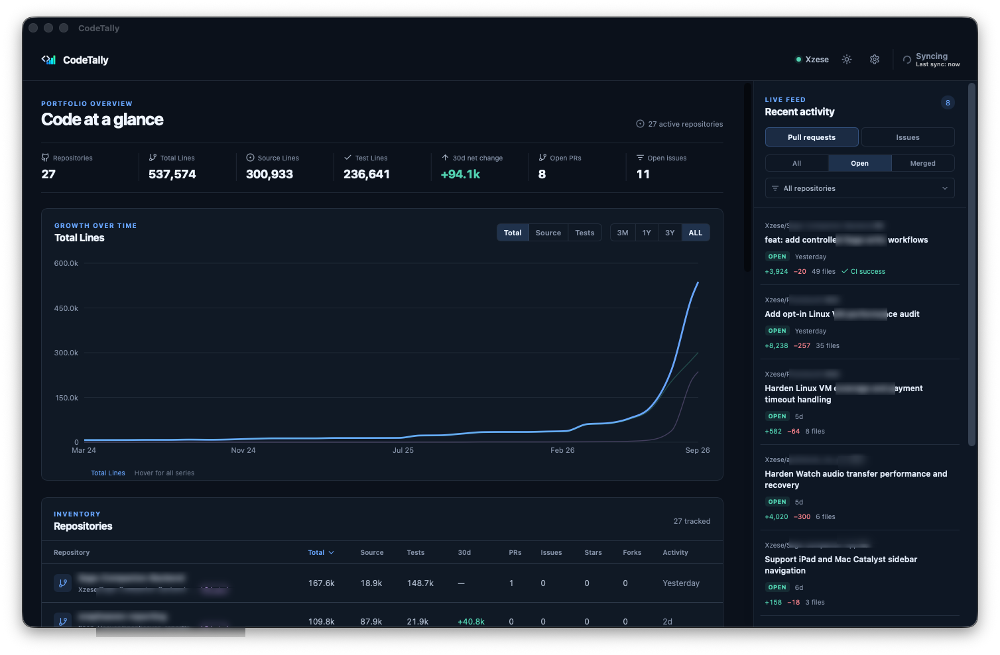
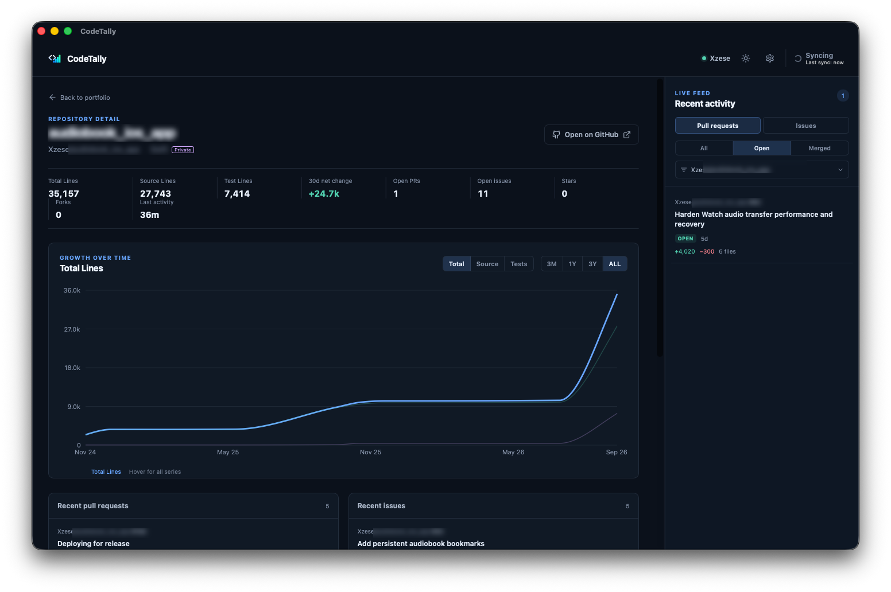
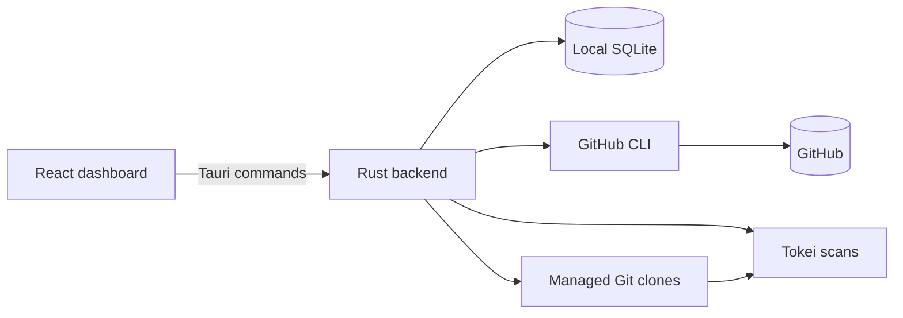

# CodeTally

CodeTally is a local desktop dashboard for understanding the repositories available to your GitHub account. It combines source and test line history, repository metadata, and recent pull-request and issue activity in one read-only view.

The app is built with Tauri 2, React, TypeScript, Rust, SQLite, Recharts, the GitHub CLI, Git, and Tokei. It runs on your computer, stores its database and repository cache locally, and does not operate a hosted service.



## What it shows

- A portfolio summary with repository count, source lines, test lines, recent growth, open pull requests, and open issues.
- Source, test, and total line history over three months, one year, three years, or the complete sampled history.
- A sortable repository inventory with language, visibility, stars, forks, activity, and 30-day change.
- Repository detail pages with their own history, recent pull requests, recent issues, and GitHub link.
- An activity sidebar that switches between pull requests and issues and filters by state or repository.
- Progress details during imports, full refreshes, and historical backfills.



## Privacy and permissions

CodeTally is read-only. It does not create or edit repositories, pull requests, issues, releases, workflows, or GitHub accounts.

Authentication remains with the GitHub CLI. The app calls `gh` as a child process and reuses the account established by `gh auth login`; it never asks for or stores a GitHub token. Git commands use the GitHub CLI credential helper when private repositories are cloned into the managed cache.

The local database can contain private repository names, URLs, pull-request and issue metadata, line-count history, and local cache paths. Repository clones can contain the full source of private repositories. This data stays in the operating system's application-data directory and should never be committed or copied into this repository. The screenshots above redact identifying repository content for the same reason.

Normal `gh` and `git` operations still communicate with GitHub. Line analysis and database storage happen locally.

## Requirements

An installed build needs these commands available on `PATH` whenever it imports or refreshes data:

| Command | Purpose |
| --- | --- |
| `gh` | Authentication and GitHub repository, pull-request, and issue metadata |
| `git` | Local repository cache and historical checkouts |
| `tokei` | Language-aware code-line counting |

Development also requires Node.js/npm, Rust/Cargo, and the native prerequisites for Tauri 2. The project is currently built and verified on macOS.

Authenticate before launching the app:

```sh
gh auth login
gh auth status
gh api user --jq .login
```

## Run it locally

From the repository root:

```sh
npm install
npm run tauri:dev
```

The first launch checks for `gh`, `git`, `tokei`, and an authenticated GitHub CLI session. Once those checks pass, choose **Import repositories**.

The import discovers repositories owned by the current GitHub user and organizations visible to that account. Private repositories are eligible. Archived repositories remain available as metadata but are excluded from the active portfolio, and forks are excluded from portfolio line totals.

The first import can take time because the app clones each eligible repository into its private cache and samples historical commits. The interface marks totals as partial until the required repositories finish. One repository failing does not stop the remaining import.

## Build a distributable app

```sh
npm run tauri:build
```

On macOS, the `.app` and `.dmg` are written below `src-tauri/target/release/bundle/`. You can run the app bundle directly or install it from the disk image.

### Continuous integration

The [CI workflow](.github/workflows/ci.yml) runs on every pull request, pushes to `main` and `release`, and manual dispatch. It checks:

- frontend behavior with Vitest and React Testing Library;
- TypeScript compilation and the Vite production build;
- Rust backend tests, including database, scanner, and GitHub sync regressions;
- release-mode Tauri compilation on native Apple Silicon and Intel macOS runners.

CI uses standard GitHub-hosted runners, read-only repository permissions, and no account credentials. GitHub sync tests use a fake CLI rather than your live account. Superseded runs are cancelled. CI does not publish releases or upload build artifacts; the release workflow below handles distributable bundles.

To prevent merging failing changes, configure repository branch protection or a ruleset to require `Frontend checks`, `Desktop checks (Apple Silicon)`, and `Desktop checks (Intel)` after the workflow has run once. Adding the workflow alone does not enforce merge protection.

### Automated GitHub releases

The [release workflow](.github/workflows/release.yml) runs automatically after **Continuous integration** succeeds for a push to `main`. Merging a feature or fix PR into `main` is enough: no separate release PR or version bump is needed. Failed, cancelled, pull-request, and fork CI runs do not trigger publication. Every release job checks out the exact commit that passed CI, even if `main` has advanced by the time the release starts.

The workflow selects a release version, runs the frontend and backend test suites, then builds separate macOS artifacts for Apple Silicon and Intel. A successful run creates a published GitHub Release, generates release notes, tags the tested commit as `v<version>`, and attaches both DMGs. Manual workflow dispatch and pushes to the legacy `release` branch remain supported, but are not needed for normal releases. This automation takes effect when this workflow is merged into `main` and that commit's push CI succeeds.

Patch versions are automatic: if the source version is at or below the latest stable `v<major>.<minor>.<patch>` tag, the workflow increments that tag's patch version. For example, after `v0.1.2`, the next release uses `0.1.3` without a source version edit. A higher source version is used as declared, allowing intentional major or minor releases. When making such a change, update the same version in all three files:

- `package.json`
- `src-tauri/Cargo.toml`
- `src-tauri/tauri.conf.json`

Keep the root package versions in `package-lock.json` and `src-tauri/Cargo.lock` in sync as well. The selected release version is applied to all five files in each build's checkout; the workflow does not commit version bumps back to the branch. The GitHub tag and installed app record the selected version, while the source manifests retain the declared version. Publication runs are serialized so they select versions in order.

Release PRs preview the version and validate manifest consistency without building or publishing. The version is selected again after merging, using the latest tags. Rerunning an already-published commit, including recreating `release` at that commit, succeeds and skips builds and publication once the workflow confirms both macOS DMGs exist. An incomplete release or failed GitHub lookup is reported instead of being silently skipped. Workflow changes take effect after they are merged; rerunning an older failed workflow still uses its original code.

Run the release regression checks with `node --test scripts/release-preflight.check.mjs`.

Choose `CodeTally_<version>_Apple-Silicon_aarch64.dmg` for an Apple M-series Mac, or `CodeTally_<version>_Intel_x64.dmg` for an Intel Mac. Check **Apple menu → About This Mac** for your chip or processor.

macOS bundles are ad-hoc signed and their signatures are verified before publication. They are not Developer ID signed or notarized, so macOS may still require approval in **System Settings → Privacy & Security**. Developer ID signing and notarization require Apple signing credentials stored as GitHub Actions secrets.

Older builds such as `v0.1.2` can show “CodeTally is damaged” because the executable's linker signature does not seal the whole app bundle. Install a release containing the bundle-signing fix. Renaming an older download does not repair its signature.

## Everyday use

The rightmost **Refresh** control performs an immediate full synchronization of GitHub activity and line counts. While work is running, that same control becomes **Syncing** or **Importing**. Hover, focus, or click it to see progress; click again to pin or dismiss the details.

Automatic activity refreshes keep repository metadata, pull requests, and issues current while the app is open. The defaults are:

- activity refresh every 10 minutes;
- line-count sweep every 45 minutes;
- refresh a repository's line counts when its GitHub `pushedAt` value changes.

The Settings drawer offers activity intervals of 1, 2, 5, 10, or 15 minutes and line-count intervals of 30, 45, or 60 minutes. These settings are stored in the local database. Previously saved intervals are preserved; installations using a short interval can select 10 or 15 minutes to reduce polling.

Automatic repository discovery and metadata refresh run at most once per hour; manual **Refresh** forces discovery. Activity refreshes combine pull requests, issues, and exact open counts into paginated queries. Open items are refreshed regardless of age, including pull-request CI status. The first activity import fetches closed or merged items updated in the last 30 days; later refreshes fetch changes since each feed's saved checkpoint, with a five-minute overlap. Previously cached history is retained.

Large feeds are processed up to five pages of 100 items per feed per cycle, then resumed from saved progress on the next cycle. Repository processing rotates after an interrupted refresh so later repositories also get a turn. A partial import does not advance the last-successful-sync timestamp.

When GitHub reports a low or exhausted API quota, CodeTally saves a pause until the reset time and stops further requests. Secondary rate limits also trigger a cooldown. Pauses survive restarts, cached data stays readable, and scheduled refreshes resume after the cooldown. Manual refreshes respect the same pause. This reduces API consumption and handles limits shared with other applications using your GitHub account.

The activity sidebar starts on open pull requests. Switching between pull requests and issues resets the state filter to **Open**. On a repository detail page, the feed remains locked to that repository; returning to the portfolio restores the previous dashboard filter.

## How line counts work

Every counted line is assigned to either **Source** or **Tests**, so **Total = Source + Tests**. Blank lines and comments are excluded.

Tokei provides language-aware counts for recognized files. A tracked-file fallback covers project code and configuration that Tokei does not recognize, including `.command` files, extensionless scripts, package lists, service definitions, environment examples, workflows, and other text-based build inputs. Shell files that Tokei misses are scanned through its Shell parser. Other unknown text formats count nonblank lines except common full-line comment markers; comment handling for an unknown syntax is therefore approximate.

Test files are identified by conventional paths such as `test`, `tests`, `__tests__`, `spec`, and `specs`, and by common filename patterns including `*.test.*`, `*.spec.*`, `test_*.py`, `*_test.py`, `*Tests.swift`, `*_test.go`, and `*_test.rs`. Per-repository classifier overrides are supported by the backend, although the current UI does not yet provide an editor for them.

The scanner excludes documentation-only languages, binaries, ignored paths, Git metadata, `.repowise`, and common generated or dependency directories such as `node_modules`, `vendor`, `dist`, `build`, `coverage`, `.next`, virtual environments, `target`, and `DerivedData`.

History is sampled monthly from the earliest reachable commit on the default branch, with newer current snapshots added as repository heads change. The 7-, 30-, and 90-day figures are net changes between stored snapshots, not a sum of additions from commits. A missing baseline is displayed as unavailable instead of zero growth.

## Local data and recovery

Tauri selects the operating system's per-user application-data directory. On macOS, this project uses:

```text
~/Library/Application Support/com.samfaid.codetally/
├── codetally.sqlite3
└── repositories/
    └── <owner>/<repository>/
```

The SQLite database stores repository metadata, activity, settings, errors, and line-count snapshots. The `repositories` directory is the managed Git cache. Neither location lives inside the source checkout.

Cached data remains readable when GitHub or a required command is temporarily unavailable. Removing the application-data directory resets the dashboard and its repository cache; the next import recreates both. This is a destructive reset, so copy the directory first if you need to preserve its history.

Scanner and history-sampling versions are stored in the database. When counting behavior changes, derived line snapshots are invalidated and rebuilt while GitHub metadata, settings, activity, and managed clones are retained.

## Architecture



- `src/` contains the React interface, Tauri command wrappers, formatting helpers, and Vitest tests.
- `src-tauri/src/` contains GitHub discovery, synchronization, Git operations, classification, persistence, and Tauri commands.
- `src-tauri/tests/` contains backend behavior and migration tests.
- `src-tauri/capabilities/` defines the desktop permissions exposed to the frontend.

The frontend does not talk to GitHub or SQLite directly. It invokes Rust commands through Tauri, and the backend serializes synchronization jobs so multiple refreshes cannot mutate the cache simultaneously.

## Development commands

```sh
npm run dev          # Vite frontend only
npm run tauri:dev    # Desktop app with live frontend development
npm run build        # TypeScript checks and Vite production build
npm run tauri:build  # Native release bundle
npm test             # Vitest suite
npm run test:watch   # Vitest in watch mode
cargo test --manifest-path src-tauri/Cargo.toml
```

JavaScript dependencies use npm and are pinned by `package-lock.json`. Rust dependencies are pinned by `src-tauri/Cargo.lock`. Keep both lockfiles in changes that alter dependencies.

## Troubleshooting

Check the three runtime commands and the active GitHub session:

```sh
command -v gh git tokei
gh auth status
gh api user --jq .login
```

If a cached dashboard opens but refresh fails, restore the missing dependency or GitHub session and choose **Refresh**. For clone failures, verify that the active account can read the repository and that the application-data directory is writable. Sync errors remain visible in the dashboard and do not erase previously cached data.

## Current limits

The app does not merge pull requests, edit issues, manage Actions, browse commits, calculate contributor or repository-health metrics, upload data to a hosted service, or support multiple local profiles. GitHub authentication remains the responsibility of the GitHub CLI.

No software license has been selected for this repository yet. Public visibility allows people to read the source, but does not grant permission to redistribute or reuse it until a license is added.
