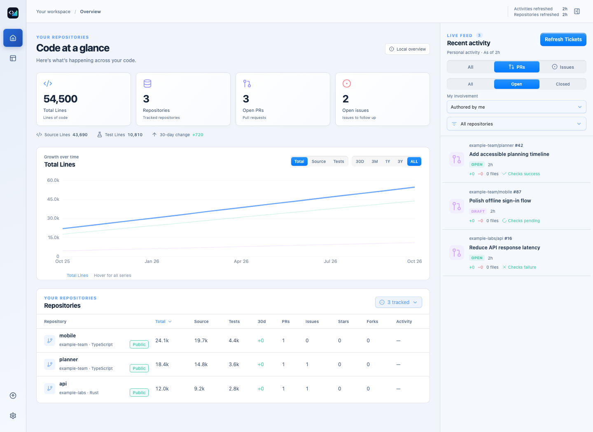
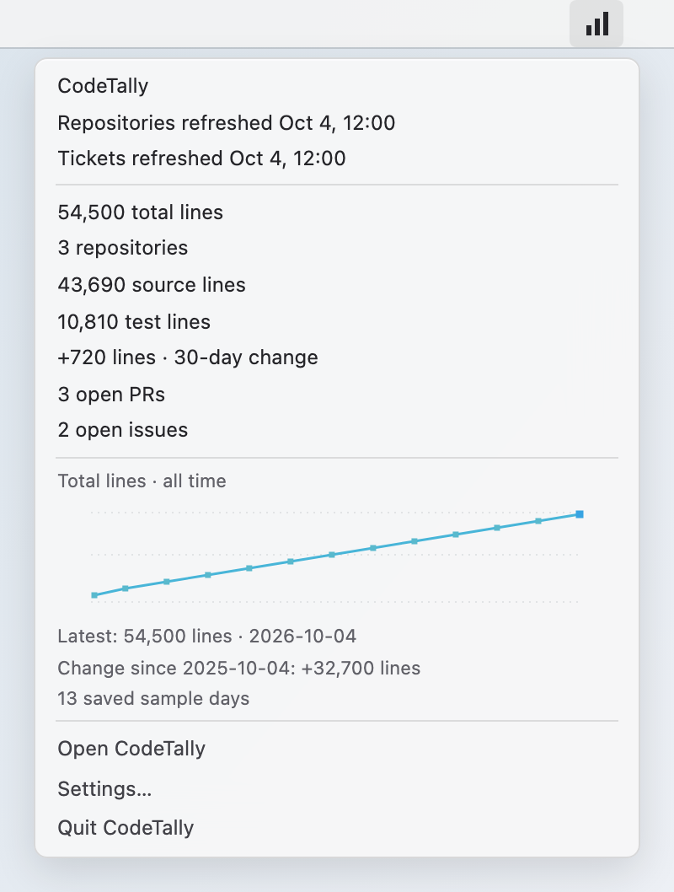
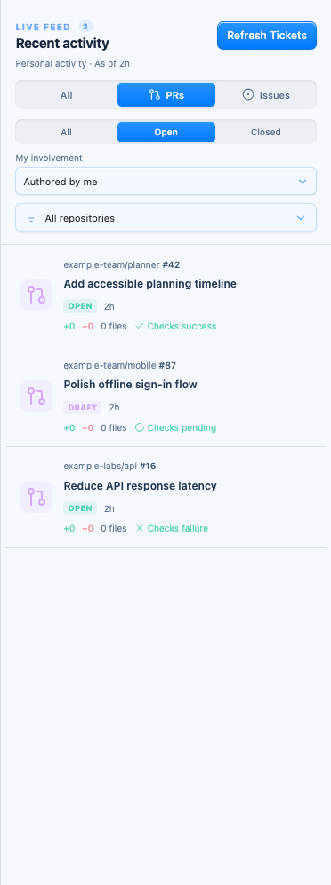
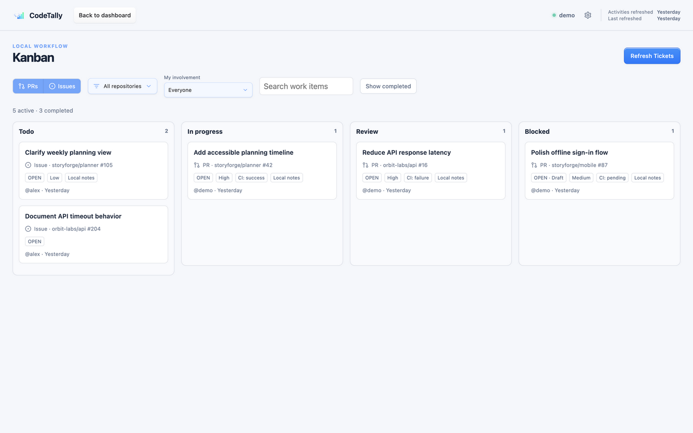

# CodeTally

A local desktop dashboard for your GitHub repositories. Track source and test line history, browse repository metadata, and see recent pull requests and issues in one place.

Built with Tauri, React, TypeScript, Rust, and SQLite. Currently built and verified on macOS.



## Features

- Portfolio totals and source/test line history.
- Sortable repositories with language, visibility, activity, and recent growth.
- Repository detail pages and filterable pull-request and issue feeds.
- A local Kanban board with notes, priorities, and ticket placement.
- Menu bar metrics, automatic refreshes, and progress tracking for imports.

## Menu bar

Keep your repository metrics visible in the macOS menu bar while CodeTally runs in the background. Choose total, source, or test lines, open pull requests, and open issues in **Settings → Appearance & menu bar**. Use separate metric icons or a combined item with the dashboard summary and line-count chart.

Click a PR or issue metric to browse recently updated open tickets grouped by repository and open them on GitHub. Line-count menus show history from saved samples. You can also reopen CodeTally, open Settings, or quit from the menu bar.

<table width="100%">
  <tr>
    <th width="50%">Menu bar summary</th>
    <th width="50%">Pull requests</th>
  </tr>
  <tr>
    <td valign="top"></td>
    <td valign="top"></td>
  </tr>
</table>

## Kanban board

Open **Kanban Board** to organize cached pull requests and issues across your tracked repositories. Filter by repository, owner, involvement, or text, and move open cards between **Todo**, **In progress**, **Review**, and **Blocked**. Add priorities and personal notes to keep your next steps close to the work.

Closed issues and closed or merged PRs appear in **Done**, which you can reveal with **Show completed**. Card details include GitHub activity and local planning controls. **Refresh Tickets** updates your authored and assigned tickets without scanning code. Notes, priorities, and card placement stay on your computer; GitHub state changes happen on GitHub.



## Get started

Install `gh` (GitHub CLI), `git`, and `tokei`, and make sure they are on `PATH`. To run from source, you also need Node.js/npm, Rust/Cargo, and the native prerequisites for Tauri 2.

```sh
gh auth login
npm install
npm run tauri:dev
```

On first launch, choose **Import repositories**. CodeTally discovers repositories owned by your account and visible organizations, including private repositories. The initial import can take time while repositories are cloned and their history is sampled.

Use **Refresh Tickets** for personal PR and issue activity, or **Settings → Background & refresh → Force Refresh** for a full synchronization. Adjust automatic refresh intervals in Settings. Archived repositories are excluded from the active portfolio, and forks are excluded from line totals by default.

## Privacy

GitHub access is read-only; Kanban planning changes stay local. CodeTally uses your existing GitHub CLI authentication. It does not ask for or store a GitHub token. Metadata, line history, and repository clones—including private source code—are stored locally in the operating system's application-data directory. GitHub requests still require a network connection.

## Development

```sh
npm test             # Frontend tests
npm run build        # TypeScript checks and frontend build
npm run tauri:build  # Native app bundle
cargo test --manifest-path src-tauri/Cargo.toml
```

## More information

- [User guide](docs/user-guide.md): menu bar controls, Kanban, refresh behavior, line-count rules, and troubleshooting.
- [Development guide](docs/development.md): architecture, build outputs, CI, and releases.

No software license has been selected yet. Public visibility does not grant permission to redistribute or reuse the source.
