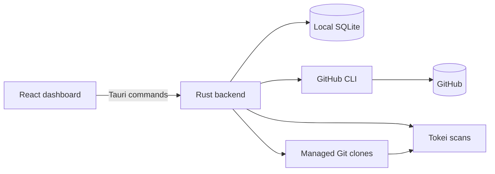

# Developing CodeTally

[Back to README](../README.md)

## Build a distributable app

```sh
npm run tauri:build
```

Local desktop builds from every worktree preserve the finished app, installer and executable in
the primary checkout’s `artifacts/tauri/native-release/` (or `<target>-release/` for an explicit Rust
architecture, and `*-debug/` for debug builds). Only the latest successful output
for each target/profile is retained. Each local build or development session uses
its own temporary Cargo directory and removes it on success, failure or a normal
Ctrl-C exit, so simultaneous runs cannot delete one another’s compiler output.
A forced termination or failed artifact copy can leave output for recovery.

Use `npm run tauri:build`, `npm run tauri:dev`, or `npm run tauri -- build/dev`
to get this cleanup. The repository-wide `git desktop-build` launcher also works in older branches
that do not contain the npm wrapper. Direct Cargo/Tauri commands bypass cleanup. Set
`CODETALLY_KEEP_BUILD_ARTIFACTS=1` to keep compiler caches for faster incremental
builds; otherwise the next run recompiles dependencies. CI keeps its existing
output paths so release verification and uploading continue to work.

### Continuous integration

The [CI workflow](../.github/workflows/ci.yml) runs on feature pull requests, pushes to `main`, and manual dispatch. It checks:

- frontend behavior with Vitest and React Testing Library;
- TypeScript compilation and the Vite production build;
- Rust backend tests, including database, scanner, and GitHub sync regressions;
- release-mode Tauri compilation on native Apple Silicon and Intel macOS runners.

An initial change check compares the full pull-request diff or all commits in a push. Frontend tests and desktop builds run only when app source, native code and assets, public assets, scripts, dependencies, build/test configuration, or workflow files change. README, documentation, and documentation screenshot-only updates skip those checks. CI still runs a small Linux change check and two brief Linux status jobs to preserve both required desktop check names; the frontend job reports skipped. This keeps documentation-only pull requests mergeable without starting macOS runners or installing dependencies. Change-detection failures fail the required checks instead of silently skipping validation. Manual dispatch always runs the full suite.

CI uses standard GitHub-hosted runners, read-only repository permissions, and no account credentials. GitHub sync tests use a fake CLI rather than your live account. Superseded runs are cancelled. CI does not publish releases or upload build artifacts; the release workflow below handles distributable bundles.

To prevent merging failing changes, configure repository branch protection or a ruleset to require `Frontend checks`, `Desktop checks (Apple Silicon)`, and `Desktop checks (Intel)` after the workflow has run once. Adding the workflow alone does not enforce merge protection.

### Automated GitHub releases

The [release workflow](../.github/workflows/release.yml) runs nightly at **00:00 UTC** and publishes the exact `main` commit that triggered the scheduled run. It records that commit once, then uses the same SHA for version selection, tests, builds, and the published tag. Later changes to `main` wait for the next run.

Nightly and manual runs use the built-in `GITHUB_TOKEN`; no custom source-selection credentials are required. Source selection has read-only repository access and does not update `main`. Only publication has repository write access, to create the tag and upload the release assets. There is no separate release branch.

With no new commits, the workflow checks the selected commit and skips builds if it is already published. A previous build failure before publication is retried on the next nightly run. Every new `main` commit, including documentation changes, is eligible for nightly publication. The schedule becomes active once this workflow is merged into `main`, GitHub's default branch; scheduled runs may start later than their scheduled time.

For immediate publication, manually run the workflow from `main`. Dispatches from other branches skip publication. Pushes and merges into `main` run CI and wait for the nightly run to publish; they do not trigger immediate releases.

The release workflow selects a version, repeats the frontend and backend tests against the release commit, then builds separate macOS artifacts for Apple Silicon and Intel. Each build includes a DMG plus a signed updater archive and is mounted, deep-signature verified, architecture checked, launched briefly on a matching runner, detached, and extracted from its updater archive before upload. Cross-architecture builds still receive all structural checks; a live launch is skipped when the runner architecture does not match. A successful run creates a published GitHub Release, generates release notes, tags the release commit as `v<version>`, and attaches both DMGs, updater archives, signatures, and the static `latest.json` updater manifest.

Patch versions are automatic: if the source version is at or below the latest stable `v<major>.<minor>.<patch>` tag, the workflow increments that tag's patch version. For example, after `v0.1.2`, the next release uses `0.1.3` without a source version edit. A higher source version is used as declared, allowing intentional major or minor releases. When making such a change, update the same version in all three files:

- `package.json`
- `src-tauri/Cargo.toml`
- `src-tauri/tauri.conf.json`

Keep the root package versions in `package-lock.json` and `src-tauri/Cargo.lock` in sync as well. The selected release version is applied to all five files in each build's checkout; the workflow does not commit version bumps back to the branch. The GitHub tag and installed app record the selected version, while the source manifests retain the declared version. Publication runs are serialized so they select versions in order.

Pull requests do not build or publish releases. The version is selected after merging, using the latest tags. Rerunning an already-published commit succeeds and skips builds and publication once the workflow confirms both macOS DMGs exist. An incomplete release or failed GitHub lookup is reported instead of being silently skipped. Workflow changes take effect after they are merged; rerunning an older failed workflow still uses its original code.

Run the release regression checks with `node --test scripts/release-preflight.check.mjs scripts/release-workflow.check.mjs`. The workflow checks use Ruby's bundled YAML parser (available on the Ubuntu CI runners) to execute the actual source-selection shell steps without credentials for scheduled and manual runs, verify that branch refs remain unchanged, and enforce main-only triggers and the same selected SHA throughout publication. Both checks also run in CI and before release builds.

Choose `CodeTally_<version>_Apple-Silicon_aarch64.dmg` for an Apple M-series Mac, or `CodeTally_<version>_Intel_x64.dmg` for an Intel Mac. Check **Apple menu → About This Mac** for your chip or processor.

macOS bundles and updater archives are ad-hoc signed and verified before publication. The release workflow requires the `TAURI_SIGNING_PRIVATE_KEY` GitHub Actions secret to create updater signatures. Builds are not Developer ID signed or notarized, so macOS may still require approval in **System Settings → Privacy & Security**. Developer ID signing and notarization require Apple signing credentials stored as GitHub Actions secrets.

Older builds such as `v0.1.2` can show “CodeTally is damaged” because the executable's linker signature does not seal the whole app bundle. Install a release containing the bundle-signing fix. Renaming an older download does not repair its signature.

## Architecture



- `src/` contains the React interface, Tauri command wrappers, formatting helpers, and Vitest tests.
- `src-tauri/src/` contains GitHub discovery, synchronization, Git operations, classification, persistence, and Tauri commands.
- `src-tauri/tests/` contains backend behavior and migration tests.
- `src-tauri/capabilities/` defines the desktop permissions exposed to the frontend.

The frontend does not talk to GitHub or SQLite directly. It invokes Rust commands through Tauri, and the backend serializes synchronization jobs so multiple refreshes cannot mutate the cache simultaneously.

## Efficiency and regression checks

Dashboard polls reuse cached summaries and history while SQLite is unchanged. A persistent read-only observer checks `PRAGMA data_version`, so commits from synchronization or another connection invalidate the cache. Growth cutoffs also expire it when a measurement crosses the current, 7-day, 30-day, or 90-day boundary; entries live at most one minute. A write during a rebuild prevents that result from being cached.

LOC snapshots store Source, Tests, and Docs separately; their stored `total_loc` remains Source + Tests. API totals and growth are projected from the saved `total_line_categories` preference. The Docs classifier upgrade queues prior commit SHAs and measurement dates transactionally before removing stale counts. Line refresh rescans and restores those measurements, reusing per-commit results; unfinished queue entries survive restarts. Monthly backfill can move a commit sample earlier, so preserved measurement dates are also represented as observations.

Activity pages publish their rows, server counts, and pagination checkpoint in one transaction. Unchanged upserts avoid row updates. History is scoped and ordered in SQLite, then aggregated in one pass. Managed Git caches fetch the default branch without tags; an empty cache bootstraps available branches before subsequent fetches become scoped.

GitHub activity refreshes batch the pending open/closed PR and issue feeds into one request per round, with independent cursors and a five-page limit per feed. Completed feeds leave subsequent requests. Successful pages remain durable even if a later request fails or quota runs low. Closed issues use GitHub's [updated-since filter](https://docs.github.com/en/graphql/reference/issues#issuefilters), including the same overlap window used locally; filtered cursors retain their exact bound, while legacy cursors finish with their original unfiltered query.

Discovery requests the authenticated login, quota and owned repositories together, following pages of 100 before publishing complete metadata. It validates account identity and advancing cursors, and retains cached repositories if a page fails or the 10,000-repository/100-page bound is reached. Organizations are still listed in REST pages of 100. Refreshes authenticate through their data requests rather than a separate `gh auth status` request. Missing authentication or HTTP 401 stops the job, preserves already committed pages, and reports login instructions; repository permission errors remain local to that repository. Initial setup still checks authentication and required tools.

Synthetic request-count checks through the real `gh` subprocess boundary show:

| Activity workload per repository | Earlier requests | Batched requests |
| --- | --- | --- |
| Four single-page feeds | 2 | 1 |
| Four two-page feeds | 6 | 2 |

These counts exclude discovery and authentication and do not claim the same reduction in GraphQL primary-quota points. Run `cargo test --manifest-path src-tauri/Cargo.toml --test sync_scalability` to verify data correctness, independent pagination, same-timestamp CI/state updates, checkpoint recovery, and the request bounds.

Read-only live profiling on 3 October 2026 found another request saved on each refresh by removing the authentication preflight, which took 0.32–1.62 seconds in two samples. Combining identity/quota with owned-repository discovery returned identical metadata for 24 repositories: two requests became one, and elapsed time fell from 2.31 to 1.97 seconds and from 1.77 to 1.39 seconds in two trials. These are small live samples, not latency guarantees.

Cross-repository activity batching was also measured but not adopted. Across three repositories and 101 activity rows, a combined request returned identical data and cost the same 18 GraphQL points as three separate queries. It improved one trial from 8.20 to 4.37 seconds but slowed another from 3.35 to 7.49 seconds. The importer keeps its bounded per-repository batches. A live invalid-cursor probe also confirmed that GitHub nulls the repository response, including otherwise healthy feeds, so the importer retains its conservative checkpoint recovery.

The frontend reuses embedded dashboard history, loads chart code separately, and preserves unchanged records so progress updates can skip inventory rendering. Date and number formatters are shared. The displayed logo uses lossless WebP; its original PNG remains available as the source asset.

Representative local debug-build measurements (synthetic fixtures, not end-to-end latency guarantees):

| Workload | Result |
| --- | --- |
| 1,000 repositories, 180,000 historical samples | Full dashboard build about 314 ms |
| Ten unchanged reads of that dashboard | About 24 microseconds total, excluding IPC cloning and serialization |
| 100 PR writes | About 172 ms as individual commits; about 3 ms as one activity-page transaction |
| Initial JavaScript bundle | About 192 KB; chart code loads separately |
| Logo encoding | 433 KB PNG to 247 KB lossless WebP |

Run `cargo test --manifest-path src-tauri/Cargo.toml --test backend_logic large_portfolio_history -- --nocapture` to repeat the portfolio benchmark. The backend tests also cover cache invalidation, time boundaries, atomic page failure, resumed feeds, and managed Git branch changes. The frontend suite checks visible updates during an ongoing import and repository detail navigation.

## Development commands

### Fixture screenshot generator (macOS)

```sh
npm run screenshots:fixtures
npm run screenshots:fixtures -- --output-dir /tmp/codetally-gallery
```

The generator builds a separate **CodeTally Screenshot Fixture** app with its own bundle identifier, seeds temporary databases with fictional repositories, tickets, and line history, and captures the real app and native menu bar menus. It covers the overview, repository details, analytics, PR and issue feeds, Kanban, Settings, the combined summary, and each separate metric menu. A JSON manifest lists the generated PNGs.

The fixture app does not read your regular CodeTally database or refresh GitHub. It stops after capture and removes its temporary build and databases on success. If capture fails after building, it prints the retained temporary directory for diagnosis. Cargo dependencies must already be available locally because the build runs offline. The command requires macOS Accessibility and Screen Recording access for the terminal or host app, and checks these before building; see `npm run screenshots:fixtures -- --help`.

In **Settings → Appearance & menu bar**, enable **Combined menu bar item** for one icon containing all seven dashboard metrics and the LOC line chart. Disable it to restore your separate metric selections. A compact icon rail switches between Overview and the optional Kanban page. The dashboard uses four primary metric cards and a source/test/docs/change breakdown; the line chart saves category visibility locally and requires at least one of Source, Tests, or Docs to remain visible. Total Lines and growth use the saved Total Lines category setting (Source + Tests by default); the chart total sums its independently visible categories.

### README screenshots (fixture data)

The checked-in screenshots use fictional fixture repositories, tickets, people, notes, and counts. They do not require a GitHub login or the installed app's database. To regenerate the menu simulations without macOS capture permissions:

```sh
npx playwright install chromium --only-shell  # one-time browser installation
npm run screenshots:menus
npm run screenshots:menus -- --output-dir /tmp/codetally-menus
```

The command starts an isolated browser fixture app, captures light and dark combined summaries plus PR and issue menus, and stops the app and browser. It blocks requests outside the local fixture server, freezes the fixture date, and writes a `menu-simulations.json` manifest. The summaries reuse the actual in-app preview; ticket menus follow the native grouping and labels. Use `--browser-executable PATH` for an existing Chromium installation. See `npm run screenshots:menus -- --help` for options.

These commands generate a native screenshot gallery with equivalent fixture views; the native captures will not exactly match the browser screenshots checked in here:

```sh
npm run screenshots:fixtures
npm run screenshots:fixtures -- --output-dir /tmp/codetally-gallery
```

The generator builds a separate fixture app, seeds a disposable database, and does not invoke `gh`, `git`, synchronization, or updater checks. It writes captures to `docs/screenshots` by default; `--output-dir` keeps an alternate gallery outside the repository. macOS Accessibility and Screen Recording access are required for native window and menu capture. See `npm run screenshots:fixtures -- --help` for details.

### Build and test

```sh
npm run dev          # Vite frontend only
npm run tauri:dev    # Desktop app with live frontend development
npm run build        # TypeScript checks and Vite production build
npm run tauri:build  # Native release bundle
npm test             # Vitest suite
npm run test:watch   # Vitest in watch mode
cargo test --manifest-path src-tauri/Cargo.toml
```

JavaScript dependencies use npm and are pinned by `package-lock.json`. Rust dependencies are pinned by `src-tauri/Cargo.lock`. Keep both lockfiles in changes that alter dependencies.
