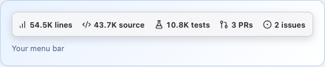
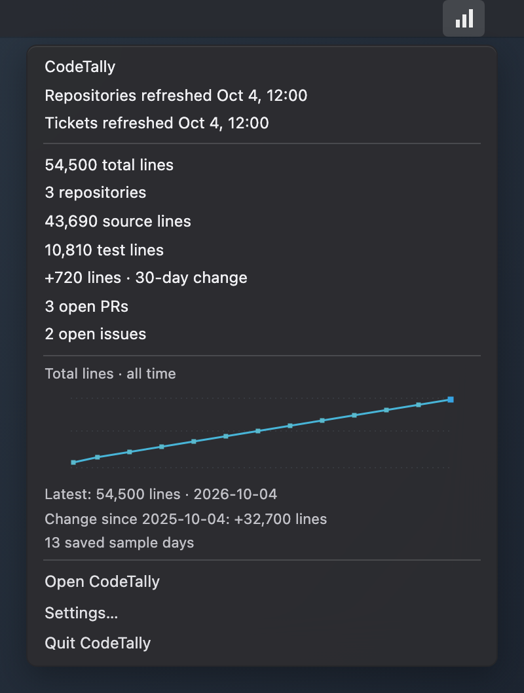
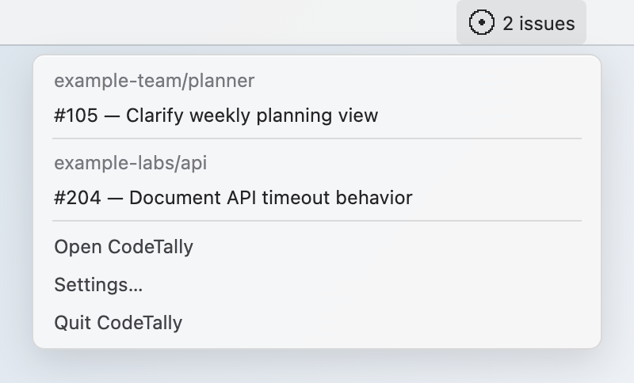
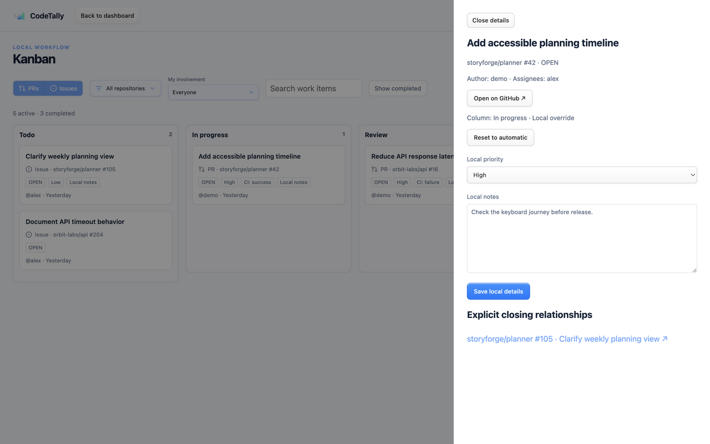
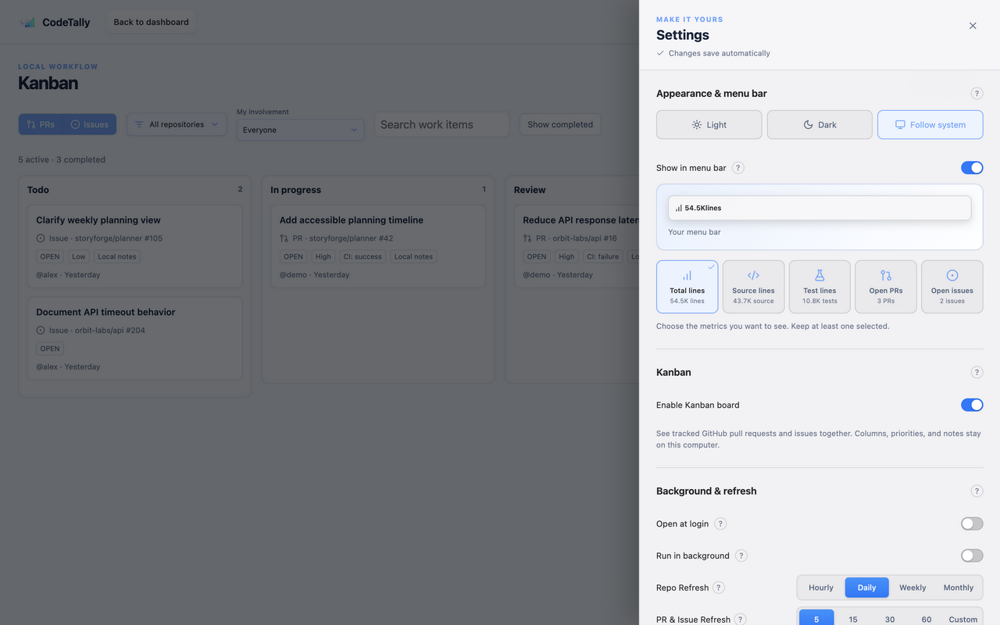
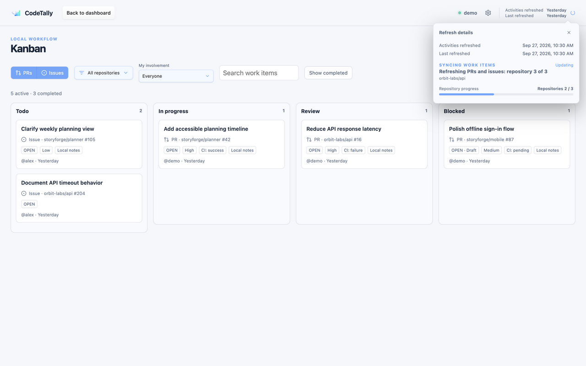
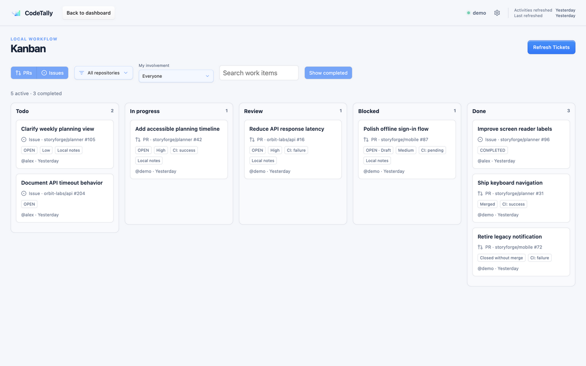

# CodeTally user guide

[Back to README](../README.md)

## Menu bar

Keep selected metrics visible while CodeTally runs in the background. **Settings → Appearance & menu bar** lets you select total, source, or test lines, open PRs, and open issues, or hide all menu icons with **Show in menu bar**.



Enable **Combined menu bar item** for one icon with all seven dashboard metrics and the line-count chart. The light and dark examples below reuse the app's combined-menu preview with fictional data.

| Combined summary · light | Combined summary · dark |
| --- | --- |
|  |  |

Each separate metric has its own native icon. Click the PR or issue metric to see up to 25 recently updated open items from tracked repositories, then select an item to open its GitHub page. Every metric menu also offers **Open CodeTally**, **Settings…**, and **Quit CodeTally**. Reopen the app from Applications or the Dock if its menu icons are hidden.

| Pull request menu | Issue menu |
| --- | --- |
|  |  |

These four menu images are browser-rendered simulations using fixture data, native icon bitmaps, and the app's menu-preview styling. macOS controls the exact appearance of the real menus. Generate them with `npm run screenshots:menus`; no obfuscation or personal-account data is used.

## Privacy and permissions

GitHub access for this feature is read-only. CodeTally does not create or edit remote repositories, pull requests, issues, reviews, merges, releases, workflows, or GitHub accounts. Kanban columns, priorities, ordering, filters, and notes are editable in the local SQLite database only.

Authentication remains with the GitHub CLI. The app calls `gh` as a child process and reuses the account established by `gh auth login`; it never asks for or stores a GitHub token. Git commands use the GitHub CLI credential helper when private repositories are cloned into the managed cache.

The local database can contain private repository names, URLs, pull-request and issue metadata, Kanban notes, line-count history, and local cache paths. Repository clones can contain the full source of private repositories. This data stays in the operating system's application-data directory and should never be committed or copied into this repository. The checked-in screenshots use fictional fixture data; they contain no repository or activity copied from a GitHub account.

Normal `gh` and `git` operations still communicate with GitHub. Line analysis and database storage happen locally.

## Requirements

An installed build needs these commands available on `PATH` for its existing full import and line-count refresh. **Refresh Tickets** needs only an authenticated `gh`:

| Command | Purpose |
| --- | --- |
| `gh` | Authentication and GitHub repository, pull-request, and issue metadata |
| `git` | Local repository cache and historical checkouts |
| `tokei` | Language-aware code-line counting |

Development also requires Node.js/npm, Rust/Cargo, and the native prerequisites for Tauri 2. The project is currently built and verified on macOS.

Authenticate before launching the app:

```sh
gh auth login
gh auth status
gh api user --jq .login
```

## Run it locally

From the repository root:

```sh
npm install
npm run tauri:dev
```

The first launch checks for `gh`, `git`, `tokei`, and an authenticated GitHub CLI session. If GitHub authentication cannot be verified, the connection guide provides a copyable `gh auth login --hostname github.com --web` command and a **Check connection** action. Run the command in Terminal and complete GitHub's browser authorization before checking again. Once the checks pass, choose **Import repositories**.

The import discovers repositories owned by the current GitHub user and organizations visible to that account. Private repositories are eligible. Archived repositories remain available as metadata but are excluded from the active portfolio, and forks are excluded from portfolio line totals by default.

The first import can take time because the app clones each eligible repository into its private cache and samples historical commits. The interface marks totals as partial until the required repositories finish. One repository failing does not stop the remaining import.

## Everyday use

The **Updates** button next to Settings checks for the latest stable [GitHub release](https://github.com/Xzese/CodeTally/releases). It checks when the app starts and every day by default. In **Settings → About CodeTally**, below **Check for updates**, you can change this to weekly, monthly, or never. Open the button to compare the current and new versions, **Check for updates**, or **Download update** when one is available. **Settings → About CodeTally** also checks once when you open it. **Download update** fetches and installs the signed updater archive for your Mac, then restarts CodeTally.

The title bar shows **Activities refreshed** and **Repositories refreshed**. At compact widths these labels shorten to **Activities** and **Repositories**. Its details include exact dates; the activity timestamp identifies whether the latest pass covered personal tickets or all tracked repositories. **Settings → Background & refresh → Force Refresh** starts an immediate full synchronization of tracked repository metadata, PRs, issues, and line counts. The Live Feed and Kanban offer **Refresh Tickets**, which searches your authored and assigned PRs and issues in tracked repositories and reloads the cached views. It never clones repositories, fetches Git commits, scans files, or changes line-count history. For an immediate repository-wide PR and issue pass without LOC work, use **Refresh All Tickets** in Settings. A running refresh makes these actions busy rather than starting overlapping jobs.

Startup refreshes your authored and assigned tickets using the fast personal refresh, without walking repository activity feeds or checking line counts. Automatic refreshes run while CodeTally is open, including with its window closed when background operation is enabled. The defaults are:

- **Repo Refresh** daily: discover repository metadata, refresh PRs, issues, and open counts across selected repositories, and perform due line-count work. Hourly, weekly, and monthly choices are also available; hourly may reach GitHub API limits sooner.
- **PR & Issue Refresh** every five minutes: search for authored and assigned tickets across the signed-in account and update matches in tracked repositories, including recently closed and merged tickets. This does not scan lines of code. Repository-wide open counts are updated in batches for the menu bar.
- Line counts are checked on the Repo Refresh schedule or with Force Refresh. Code changes do not trigger an extra line-count check. Exact commit-SHA deduplication prevents an already measured commit from being recounted.

Settings apply automatically when you change a control and are stored in the local database. The status at the top shows when changes are being saved and provides a retry if saving fails. Rapid changes are saved in order, and the drawer stays open. Supporting explanations are available from the **?** buttons by hovering, focusing, or clicking.

**Settings → About CodeTally** displays the installed and latest versions together, update actions, and the project repository. An **About me** section introduces Sam and links to [www.samfaid.com](https://www.samfaid.com/) and [Buy Me a Coffee](https://www.buymeacoffee.com/samfaid).

The **Background & refresh** section has one **Repo Refresh** interval for repository data and due line counts: hourly, daily, weekly, or monthly, with daily as the default. Its hourly choice warns about GitHub API limits. Previously saved custom Repo Refresh intervals change to daily on upgrade. **PR & Issue Refresh** has a separate interval, five minutes by default, and retains its custom option.

In **Settings → Appearance & menu bar**, choose **Light**, **Dark**, or **Follow system**. Follow system is the default and responds to macOS appearance changes while the app is open.

On macOS, select one or more of **Total lines**, **Source lines**, **Test lines**, **Open PRs**, and **Open issues** to combine them in the menu bar. At least one metric stays selected, and the display uses that fixed order. Every selected metric has its own consistently aligned native icon. Use the **Compact** switch above any metric to show just its icon and number; full titles remain the default for existing users. The Settings preview scrolls horizontally at narrow widths so it keeps each item's actual width. Clicking a line-count metric shows a line chart inside the native menu from saved LOC samples, connecting each sample to the next. It follows the dashboard's selected **30D**, **3M**, **1Y**, **3Y**, or **ALL** time range, including after restart, and does not refresh or scan code. Clicking the PR or issue metric opens up to 25 cached open items in repository sections; tickets appear directly beneath each repository heading and open their GitHub page when selected. **Show in menu bar** can hide every CodeTally menu item. Hover or focus a card to preview adding its current cached value before selecting it. The preview shows only CodeTally's display, and the actual menu bar updates when settings change or synchronization completes. Existing single-metric preferences are preserved.

**Include forks in line totals** is disabled by default. Enable it in Settings to count selected fork repositories in portfolio totals and line history.

Enable **Open at login** to start CodeTally automatically when you sign in to your Mac. This uses the macOS login-item setting, so you can also manage it in System Settings. The packaged app repairs stale enabled registrations to use the current app, and leaves disabled entries untouched. Development builds do not change the installed app's login item.

**Keep running in the background when the window closes** is enabled by default. With the menu bar visible, CodeTally runs without a Dock icon. Use **Show CodeTally** in the menu bar to reopen the dashboard and **Quit CodeTally** to stop the app. If you hide the menu bar, CodeTally keeps its Dock icon so you can still reopen it. Disable background operation to quit when the main window closes. Background operation does not keep the Mac awake.

The **tracked** count above the repository table opens **Show in table**. Uncheck individual repositories or a whole owner group to hide rows, and use **Show all** to restore them. Personal repositories appear first, followed by each organization by name; groups start collapsed. This is a temporary table filter: tracking, background sync, portfolio totals, history, and activity continue unchanged. The filter resets when you leave the dashboard.

In **Settings → Repositories**, expand **Personal repositories** or a named organization to select which repositories CodeTally tracks. The personal and company master switches pause tracking while preserving individual choices. Each organization's toggle is on when any of its repositories are selected; turning it off deselects all currently discovered repositories, and turning it on selects them all. Company means repositories owned by GitHub organizations; personal means repositories owned by the signed-in account. All repositories are tracked by default. Settings use the same collapsed owner groups and support keyboard-operated checkboxes and switches.

Deselected repositories disappear from the dashboard, activity feeds, line history, and menu bar totals once the automatic save completes. Manual and background refreshes skip their activity queries, clones, and line scans. Work already running on a repository may finish; subsequent repositories use the saved selection. Personal and company master switches preserve individual choices, and disabling repositories keeps their local cache and history so they can be selected again later.

The selector lists locally discovered repositories, including deselected ones. Discovery can still list repository metadata for enabled owner groups so newly available repositories appear; disabling a whole group also skips its repository discovery. Reenable a group and refresh to discover its new repositories.

Automatic repository discovery and metadata refresh use a cache reuse window based on the Repo Refresh interval, clamped to 15 to 60 minutes. Discovery is attempted on the next Repo Refresh cycle after that window expires, so a slower interval can make discovery less frequent. Manual **Force Refresh** forces discovery. Repository PR and issue refreshes combine tickets and exact open counts into paginated queries. Open items are refreshed regardless of age, including pull-request CI status. The first activity import fetches closed or merged items updated in the last 30 days; later refreshes fetch changes since each feed's saved checkpoint, with a five-minute overlap. Previously cached history is retained.

Large feeds are processed up to five pages of 100 items per feed per cycle, then resumed from saved progress on the next cycle. Repository processing rotates after an interrupted refresh so later repositories also get a turn. A partial import does not advance the last-successful-sync timestamp.

Personal refresh uses bounded, paginated searches for authored and assigned PRs and issues, with saved progress and a short overlap. It also rechecks previously assigned cached items so removed assignments stop appearing as current. Overlapping results are deduplicated. If a GitHub search window has more than 1,000 results, CodeTally divides it into smaller time windows; an unsplittable window is reported as partial while other searches continue. This faster pass updates matching cached tickets, while Repo Refresh remains responsible for repository-wide open counts and discovery.

When GitHub reports a low or exhausted API quota, CodeTally saves a pause until the reset time and stops further requests. Secondary rate limits also trigger a cooldown. Pauses survive restarts, cached data stays readable, and scheduled refreshes resume after the cooldown. Manual refreshes respect the same pause. This reduces API consumption and handles limits shared with other applications using your GitHub account.

Both ticket refreshes use GitHub's GraphQL allowance alongside startup and manual work. The app records the reported query cost and remaining GraphQL allowance, and pauses at 100 remaining points. More selected repositories, pagination, transient retries, or other tools using the account can still exhaust the shared allowance and delay refreshes. App update checks use the separate core REST allowance and default to daily; Settings also offers weekly, monthly, or never.

The activity sidebar starts open on open pull requests. Use the title-bar panel button to hide or reopen it. The dashboard smoothly expands or contracts with the panel. Below 1,000 pixels wide, the panel collapses automatically and slides over the dashboard when reopened. The header keeps the board button and refresh times on one row while they fit, with Settings and the sidebar button aligned to the right. At compact widths **Kanban Board** becomes **Kanban** and **Back to dashboard** becomes **Dashboard**; the refresh times wrap to the right only at smaller widths. The connected GitHub account is shown under **Storage & connection** in Settings. The window can be resized down to 300 pixels; the summary and detail metrics choose their column count from available space, and the repository table scrolls sideways. **Exclude forks** in the **Show in table** menu hides fork rows without changing tracking or totals. Switching between pull requests and issues resets the state filter to **Open**. On a repository detail page, the feed remains locked to that repository; returning to the portfolio restores the previous dashboard filter.

Use **My involvement** in the feed to choose **Everyone**, **Authored by me** (default), **Assigned to me**, or **Authored or assigned to me**. “Me” is the connected GitHub account. The choice is saved automatically and applies to both pull requests and issues alongside the repository and state filters.

**Refresh Tickets** and scheduled **PR & Issue Refresh** search items involving the connected GitHub account and update matches in tracked repositories. Repo Refresh and **Refresh All Tickets** cover all selected repositories, including tickets that do not involve you. **My involvement** changes what appears in the live feed; its default is **Authored by me**.

The activity repository filter opens collapsed **Personal repositories** and named company groups. Expand a group to choose all its repositories or one repository, or choose **All company repositories** across organizations. The selected scope carries across PR and issue tabs and only filters the feed; it does not change tracking. Group selection is applied before the activity result limit.

## Local Kanban board

The board is enabled by default. Open it with **Kanban Board** in the title bar; that button becomes **Back to dashboard** while the board is open. The dashboard remains the landing screen. The board reads already cached PRs and issues from the repositories CodeTally tracks. Opening it does not import history or create Git clones. You can disable it under **Settings → Kanban**; doing so hides the board and retains local planning data for later reenabling. The ordinary activity sidebar and its refresh schedule continue.

The board starts with both **PRs** and **Issues** selected. Each button can be selected independently, including neither, then filter by repository or owner group, involvement, and text. Filters and **Show completed** are saved locally for the current GitHub account. A single-repository filter stays scoped to that repository; the all-repositories scope includes newly discovered eligible repositories. Board filters never change tracking or the personal ticket search; newly discovered repositories join after Repo Refresh discovers them.

The fixed columns are **Todo**, **In progress**, **Review**, **Blocked**, and **Done**. Open issues automatically start in Todo, draft PRs in In progress, and other open PRs in Review. Review means review work, not GitHub approval or merge readiness; CI is shown separately as a badge. Drag open cards within or between active columns. With keyboard focus on a card, use Alt+arrow keys to move it. Set None/Low/Medium/High priority and save a plain-text note in its details. **Reset to automatic** removes a local column choice. These changes never edit GitHub. GitHub-closed issues and closed or merged PRs go to Done regardless of local placement; a closed PR is labeled **Closed without merge** unless GitHub reports a merge. Reopened items return to their previous manual active column, or their automatic column. To close, merge, or reopen anything, use **Open in GitHub**.

Completed cards are hidden by default. The **Show completed** button reveals Done and cached completed history. The separate **active** and **completed** counts cover all matching cached cards, including those beyond the current page. Closed and merged cards never contribute to active count. **Load more** pages through the local cache past 1,000 items. **Refresh Tickets** updates your authored and assigned tickets and reloads the board cache; other tickets retain their last Repo Refresh data. The title bar shows the latest successful activity refresh above the last Repo Refresh or Force Refresh; open its details for exact dates and the activity scope. The board displays partial or stale import information separately from those exact cache counts, and cached items remain available offline. GitHub state appears after a successful refresh rather than through real-time webhooks. Automatic updates require CodeTally to be running and to complete a refresh.

Card details separate **GitHub details** from **Your planning**. Priority and notes are edited locally with an explicit save status; an unsaved draft remains in the pane after a save failure or an outside click. Click outside the pane to dismiss it when edits are saved. The **Activity timeline** combines the latest GitHub state, conversation comments, and PR commit history, with individual checks on the latest commit. It is read on demand through GitHub CLI, paginated, and cached per account for five minutes. HTTPS URLs in comment text are clickable; destinations of named Markdown links appear below the comment. **Refresh activity** bypasses that cache window; opening a PR normally combines its commit and check read in one GraphQL request. **Add comment on GitHub** opens the ticket on GitHub for writing; CodeTally does not submit comments. PR line review comments remain on GitHub. Passing checks alone does not prove a PR can merge. Offline, busy, or partial activity data is labeled and the saved data remains visible.

The read-only closing relationships section shows explicit GitHub closing links when available. This is a bounded, cached view, not a claim to include all mentions or cross-references. A linked PR merging does not locally close an issue; the issue moves to Done only when its own GitHub state is refreshed as closed. Notes, priorities, placement, ordering, and filters stay on this computer. There is no cross-device sync, GitHub Projects integration, extra GitHub scope, per-repository installation, PAT, or new Actions secret. The existing `gh auth login` account and its repository permissions still determine which GitHub data is available.

These board screenshots use fictional repositories, tickets, and people from the browser fixture backend. They do not read the local CodeTally database or contact GitHub.

| View | Screenshot |
| --- | --- |
| Active board across repositories |  |
| Card details |  |
| Board and refresh settings |  |
| Activity-only progress |  |
| Completed work |  |

## How line counts work

Code lines are assigned to **Source** or **Tests**, and **Total = Source + Tests** by default. In **Settings → Total Lines**, choose which categories are included in dashboard totals, repository totals, growth figures, saved history totals, and the menu bar. Use the three horizontal category buttons; the live preview shows the selected total and its breakdown. Source and Tests start selected; Docs starts deselected. Keep at least one category selected. Changes save automatically and recalculate existing measurements without rescanning. Blank lines and comments are excluded from code counts. **Docs** is a separate category: documentation formats, extensionless README/license/changelog files, and text files anywhere inside a `doc/` or `docs/` directory count as documentation, including JSON benchmark reports and code examples. Docs counts nonblank text lines, including prose, comments, and fenced code, once per file. Documentation takes precedence over test classification.

Use the chart’s **Source**, **Tests**, and **Docs** buttons to show or hide each category. At least one category stays visible. When several are visible, the chart total is their sum; hidden categories are also excluded from the tooltip and chart scale. Source and Tests are shown by default. Your selection is saved on this device and shared between dashboard and repository charts across restarts; it does not change the Total Lines setting or growth figures elsewhere.

Tokei provides language-aware counts for recognized files. A tracked-file fallback covers project code and configuration that Tokei does not recognize, including `.command` files, extensionless scripts, package lists, service definitions, environment examples, workflows, and other text-based build inputs. Shell files that Tokei misses are scanned through its Shell parser. Other unknown text formats count nonblank lines except common full-line comment markers; comment handling for an unknown syntax is therefore approximate.

Test files are identified by conventional paths such as `test`, `tests`, `__tests__`, `spec`, and `specs`, and by common filename patterns including `*.test.*`, `*.spec.*`, `test_*.py`, `*_test.py`, `*Tests.swift`, `*_test.go`, and `*_test.rs`. Per-repository classifier overrides are supported by the backend, although the current UI does not yet provide an editor for them.

The scanner excludes binaries, ignored paths, Git metadata, `.repowise`, and common generated or dependency directories such as `node_modules`, `vendor`, `dist`, `build`, `coverage`, `.next`, virtual environments, `target`, and `DerivedData`.

History is sampled monthly from the earliest reachable commit on the default branch, with newer current snapshots added as repository heads change. When upgrading to the Docs classifier, historical commits are rescanned to split out documentation; saved measurement dates are preserved, and unfinished rebuilds resume on the next line refresh. The 7-, 30-, and 90-day figures are net changes for the selected Total Lines categories between stored snapshots, not a sum of additions from commits. A missing baseline is displayed as unavailable instead of zero growth.

## Local data and recovery

Tauri selects the operating system's per-user application-data directory. On macOS, this project uses:

```text
~/Library/Application Support/com.samfaid.codetally/
├── codetally.sqlite3
└── repositories/
    └── <owner>/<repository>/
```

The SQLite database stores repository metadata, activity, settings, errors, and line-count snapshots. The `repositories` directory is the managed Git cache. Neither location lives inside the source checkout.

**Settings → Storage & connection** displays the SQLite database's file URL. Select it to reveal the database in Finder on macOS, or open its containing folder on other desktop platforms. Expand **GitHub connection** for the read-only `gh` commands used to check the local CLI installation and signed-in account: [`gh auth status`](https://cli.github.com/manual/gh_auth_status) and [`gh api`](https://cli.github.com/manual/gh_api), along with `gh --version`.

Cached data remains readable when GitHub or a required command is temporarily unavailable. Removing the application-data directory resets the dashboard and its repository cache; the next import recreates both. This is a destructive reset, so copy the directory first if you need to preserve its history.

Scanner and history-sampling versions are stored in the database. When counting behavior changes, derived line snapshots are invalidated and rebuilt while GitHub metadata, settings, activity, and managed clones are retained.

## Troubleshooting

Check the three runtime commands and the active GitHub session:

```sh
command -v gh git tokei
gh auth status
gh api user --jq .login
```

If a cached dashboard opens but refresh fails, restore the missing dependency or GitHub session and choose **Refresh**. For clone failures, verify that the active account can read the repository and that the application-data directory is writable. GitHub activity queries retry temporary connection resets and read timeouts up to three times, waiting 250 ms, 500 ms, and 1 second between attempts. Rate-limit pauses and permanent errors are not retried. If retries are exhausted, sync errors remain visible in the dashboard and previously cached data is preserved; a later scheduled or manual refresh can recover. Repeated transport failures can still indicate a network, VPN, proxy, or GitHub availability problem.
